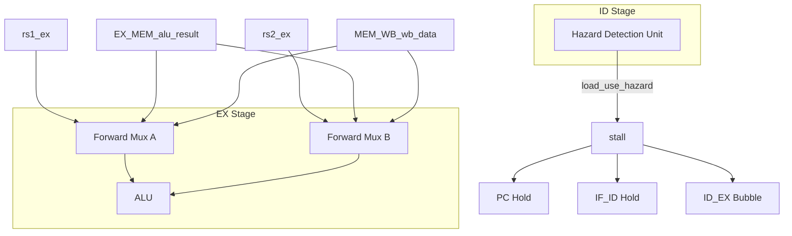

# Lab1 Phase 3：数据冒险处理实现计划

**基于 [Doc/Lab1/Phase3_PlanFix.md](Doc/Lab1/Phase3_PlanFix.md) 评估已改进**：ID_EX 气泡范式、零寄存器保护、默认 else 兜底、stall/flush 命名分离、EX_MEM/MEM_WB 死锁规避。

---

## 一、目标与范围

根据 [Doc/Lab1/Phase3.md](Doc/Lab1/Phase3.md) 和 [Doc/Lab1/Overall.md](Doc/Lab1/Overall.md)，Phase 3 需实现：

1. **转发（Forwarding）**：将 EX/MEM、MEM/WB 的结果旁路到 EX 阶段 ALU 输入端，解决 RAW 冒险
2. **阻塞与气泡（Stall & Bubble）**：检测 Load-Use 冒险，暂停 PC/IF_ID，向 ID/EX 插入气泡

当前 [vsrc/src/core.sv](vsrc/src/core.sv) 状态：Phase 2 已完成，`stall` 恒为 0，ALU 输入直接来自 RegFile，无转发逻辑。

---

## 二、实现架构




---

## 三、实现任务分解

### 3.1 转发逻辑（Forwarding Unit）

**位置**：EX 阶段，ALU 输入端之前（约 218–220 行）

**修改点**：

1. 将 `alu_opA`、`alu_opB` 从直接使用 `rs1_data_ex`/`rs2_data_ex` 改为经过转发 Mux
2. 新增 `forward_A`、`forward_B` 选择逻辑（2-bit：00=RegFile，01=EX_MEM，10=MEM_WB）
3. 数据源：
  - EX 冒险：`alu_result_mem`（EX_MEM 中 ALU 结果；Load 时此处为地址，不可用，需靠 Stall 解决）
  - MEM 冒险：`wb_data`（MEM_WB 写回数据，含 Load 结果）

**判断条件**（Phase3 文档要求）：


| 冒险类型   | 条件                                                 | 优先级 |
| ------ | -------------------------------------------------- | --- |
| EX 冒险  | `reg_write_mem && rd_mem != 0 && rd_mem == rs1_ex` | 高   |
| MEM 冒险 | `reg_write_wb && rd_wb != 0 && rd_wb == rs1_ex`    | 低   |


**Phase3_PlanFix 强调**：

- **零寄存器红线**：`rd == 0`（x0）时**绝对不能触发转发**，必须在条件中显式包含 `rd != 0`
- **默认兜底**：`if-else` 最后必须有 `else` 分支，无冒险时 ALU 输入选 RegFile 原始值
- **关键**：EX 冒险判断必须写在 MEM 冒险之前，以正确处理双重冒险（如连续三条 `ADD x1, x1, x2`）

**U 型指令**：当前 Phase 2 未实现 LUI/AUIPC，暂无需特殊处理；若后续扩展，需保证前递不破坏 imm 路径（opB 的 `alu_src_ex` 已选 imm，不受 opB 前递影响）。

---

### 3.2 冒险检测单元（Hazard Detection Unit）

**位置**：ID 阶段，组合逻辑（约 155 行之后、ID_EX 之前）

**检测条件**：

```
load_use_hazard = ID_EX.mem_read && (ID_EX.rd != 0) && 
                  (ID_EX.rd == IF_ID.rs1 || ID_EX.rd == IF_ID.rs2)
```

即：EX 阶段为 Load，且其 `rd` 与 ID 阶段指令的 `rs1` 或 `rs2` 相同。

**输出**：`stall = load_use_hazard`，替代当前 `assign stall = 1'b0`。

**Phase3_PlanFix 命名建议**：将 Load-Use 引发的停顿称为 `stall`；后续分支预测错误引发的冲刷称为 `flush`。当前 Phase 3 仅需 `load_use_hazard`，但保持 `stall` 与 `flush` 在命名和接口上独立，便于后续扩展（Branch/Jump）。

---

### 3.3 阻塞与气泡

**PC**（约 45–49 行）：已有 `if (!stall) pc <= next_pc`，无需改动。

**IF_ID**（约 59–69 行）：已有 `else if (!stall)` 分支，stall 时保持不更新，符合 Phase3 要求。

**ID_EX**（约 174–211 行）：需增加 **Bubble 分支**。

**Phase3_PlanFix 推荐 Verilog 范式**：

```systemverilog
always_ff @(posedge clk) begin
    if (reset || load_use_hazard) begin
        reg_write_ex <= 0;
        mem_read_ex  <= 0;
        mem_write_ex <= 0;
        inst_valid_ex <= 0;
        // ... 清空其他所有具有破坏性的控制信号
    end else begin
        reg_write_ex <= reg_write_id;
        mem_read_ex  <= mem_read_id;
        // ... 正常锁存并传递
    end
end
```

- 使用 `if (reset | load_use_hazard)` 统一处理气泡，`else` 正常锁存
- 气泡需清零的信号：`mem_read_ex`, `mem_write_ex`, `reg_write_ex`, `inst_valid_ex` 等所有控制信号；数据可保持或置 0（因控制为 0，不会产生副作用）

**注意**：`stall` 时 Load 从 ID_EX 进入 EX，下一拍 ID_EX 被气泡覆盖，Consumer 仍留在 IF_ID，符合 Load-Use 处理流程。

---

### 3.4 段间寄存器与 stall 的交互

**EX_MEM、MEM_WB**：当前使用 `else if (!stall)`。stall 时不应更新，否则会吞掉有效指令。需确认：stall 时 EX 输出为气泡，EX_MEM 若更新会锁存气泡，这是预期行为。但若 EX_MEM 在 stall 时**不**更新，则 Load 会卡在 EX 阶段。正确行为是：stall 时 ID_EX 被气泡覆盖，EX 收到气泡，EX_MEM 应更新（锁存气泡），这样 Load 会从 EX 进入 MEM。因此 EX_MEM、MEM_WB 在 stall 时**应继续更新**，以让 Load 正常流动。当前 `!stall` 会阻止更新，这是错误的。

**修正**：仅 PC 和 IF_ID 在 stall 时保持；ID_EX 在 stall 时写入气泡；EX_MEM、MEM_WB 应始终在 `!reset` 时更新（或仅在 reset 时清零）。需要将 EX_MEM、MEM_WB 的 `else if (!stall)` 改为 `else`，使 stall 时仍正常推进。

---

## 四、文件修改清单


| 文件                                   | 修改内容                                                                                                                                                                  |
| ------------------------------------ | --------------------------------------------------------------------------------------------------------------------------------------------------------------------- |
| [vsrc/src/core.sv](vsrc/src/core.sv) | 1) 转发 Mux 与 Forwarding Unit 逻辑 2) Hazard Detection Unit（load_use_hazard） 3) `stall` 接 load_use_hazard 4) ID_EX 增加 stall 时的 Bubble 分支 5) 确认 EX_MEM、MEM_WB 在 stall 时的行为 |


---

## 五、Phase3_PlanFix 评估要点（已纳入本计划）

**优点（已采纳）**：EX_MEM、MEM_WB 在 stall 时仍推进，避免 Load 卡死导致流水线死锁。

**需严加防范**：

- ID_EX 气泡：使用 `reset | load_use_hazard` 范式，而非 `else if (stall)`
- Forwarding：`rd == 0` 坚决不触发；`if-else` 最后必须有 `else` 兜底
- 命名：`stall` 与 `flush` 分离，为后续 Branch/Jump 预留

---

## 六、验证与完成确认 Checklist

**Todo 与 Checklist 对应**：fwd-* → 1–3；hdu-load-use + stall-flush-naming → 4–5；id-ex-bubble-pattern → 6；ex-mem-mem-wb-advance → 7；test-lab1 → 8。

- 1. Forwarding opA：EX 冒险优先于 MEM 冒险；`rd_mem == 0` 不触发
- 1. Forwarding opB：同上；`alu_src_ex=1` 时 opB 用 imm，前递仅影响 opB 当 alu_src=0
- 1. Forwarding：if-else 最后有 else 选 RegFile 原始值
- 1. HDU：`load_use_hazard` 条件正确（mem_read_ex、rd!=0、rs1/rs2 匹配）
- 1. `stall` 接 `load_use_hazard`
- 1. ID_EX：`reset | load_use_hazard` 时写气泡，清零所有控制信号
- 1. EX_MEM、MEM_WB：去掉 `!stall`，stall 时仍推进
- 1. `make test-lab1` 通过，输出含 `HIT GOOD TRAP`，无寄存器比对错误

---

## 七、与 Phase 1/2 的衔接

- Phase 1：骨架与段间寄存器已就绪，PC/IF_ID 已有 `!stall` 条件
- Phase 2：`mem_read_id` 恒为 0（无 Load），Load-Use 检测不会触发，但框架可提前实现；Forwarding 可解决算术指令的 RAW 冒险，对当前测试至关重要

