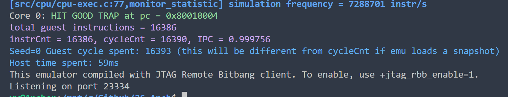
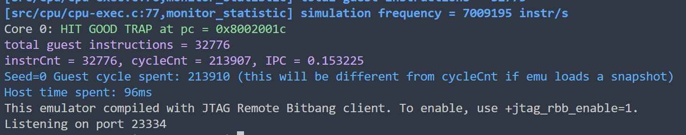

# Lab1 实现说明（更新版）

## 1. 流水线组织

实现为单发射 5 级顺序流水：

- IF：取指请求、响应缓冲与直通
- ID：译码、读寄存器、前递选择
- EX：ALU/MDU 运算、分支跳转判定
- MEM：真实数据访存（Load/Store）
- WB：写回寄存器并提交 Difftest

核心流水寄存器：

- `id_r`: `valid/pc/instr`
- `ex_r`: `valid/trap/wen/is_word/alu_cmd/rd/pc/instr/op1/op2/imm/...`
- `mem_r`: `valid/trap/wen/rd/pc/instr/result/is_load/is_store/mem_*`
- `wb_r`: `valid/trap/wen/rd/pc/instr/result`

更新顺序为 `wb <= mem <= ex <= id`。`x0` 每拍强制保持为 0。

## 2. 指令支持

### 2.1 Lab1 必做

- I 型算术逻辑：`addi/xori/ori/andi`
- R 型算术逻辑：`add/sub/and/or/xor`
- W 型算术：`addiw/addw/subw`

### 2.2 选做（已完成）

- M 扩展：`mul/div/divu/rem/remu`
- M 扩展 W 变体：`mulw/divw/divuw/remw/remuw`

### 2.3 为后续扩展已接入的基础能力

在保持 Lab1 正确性的前提下，流水线还实现了以下常见路径：

- 移位与比较：`sll/srl/sra/slt/sltu` 及 W 变体
- 控制流：`jal/jalr/branch`
- 访存：`load/store`（含字节宽度与符号扩展）

## 3. 取指与前端

前端采用“1 条 in-flight + 1 条缓冲”的取指结构：

- 请求发出后保持，直到 `iresp.data_ok`
- 响应优先直通 ID，不能直通时写入 `fetch_buf`
- 分支/跳转命中后进行前端冲刷和 PC 重定向

同时修复了仲裁器在事务边界引入的固定空泡，使连续取指可接近 1 IPC。

## 4. 数据冒险与阻塞/前递

### 4.1 前递

Decode 阶段读寄存器后进行组合覆盖，优先级：

- `EX > MEM > WB > GPR`

其中 EX 仅在结果可用时允许前递：

- `ex_forwardable = ex_r.valid && ex_r.wen && (ex_r.rd != 0) && ex_result_ready`

### 4.2 阻塞

采用“前递优先 + 必要阻塞”的策略：

- `stall_ex_busy`：EX 中 MDU 多周期结果未就绪
- `stall_mem_busy`：MEM 中 Load/Store 等待 `dresp.data_ok`
- `raw_hazard_ex/raw_hazard_mem`：对未就绪源值的 RAW 冒险
- 取指前端还受分支重定向和访存阶段占用约束

该策略在保证正确性的同时尽量减少无效气泡。

## 5. MEM 级真实访存

`dreq` 已接入真实请求，不再是空连线：

- `dreq.valid/addr/size/strobe/data` 由 `mem_r` 驱动
- Load 在响应到达后按 `size + signed/unsigned` 做提取扩展
- Store 按地址低位计算字节使能与写数据移位

因此流水线中的 MEM 级已承担真实访存语义。

## 6. MDU 多周期状态机

### 6.1 乘法

`mul/mulw` 使用迭代移位加法状态机，不使用 `*` 直接组合实现。

### 6.2 除法/取余

`div/divu/rem/remu`（含 W）使用迭代恢复除法状态机，不使用 `/` 直接组合实现。

### 6.3 边界与优化

- 除零与溢出等边界条件按 ISA 规则处理
- `0/1` 快速路径、`dividend<divisor` 快速路径、2 的幂除数快速路径
- 乘法保留提前结束逻辑

## 7. Difftest 与提交时序

- 指令提交在 WB 阶段进行（`DifftestInstrCommit`）
- `wdest` 使用 `{3'd0, wb_r.rd}` 扩展到 8 位
- `gpr_diff` 反映“当拍提交后”的寄存器状态，避免对拍错拍

## 8. 测试与性能

在 WSL 环境执行：

- `make test-lab1`：`HIT GOOD TRAP`
- `make test-lab1-extra`：`HIT GOOD TRAP`

实测结果（`-j12`）：

- `test-lab1`：`instrCnt=16386, cycleCnt=16390, IPC=0.999756`
- `test-lab1-extra`：`instrCnt=32776, cycleCnt=213907, IPC=0.153225`

说明：

- `test-lab1` 以基础单周期 ALU 为主，IPC 接近 1，符合五级单发射预期。
- `test-lab1-extra` 含大量多周期 M 指令，EX 占用时间长，IPC 明显下降属于正常现象。

## 9. AI 使用说明

大模型用于：

- 帮助整理实现方案与报告结构
- 检查位宽、连线和边界条件清单
- 生成回归验证步骤

RTL 设计、时序策略、调试定位和最终结论由本人完成。

*具体使用的AI工具为codex,模型版本 5.3，由于其出色的命令执行能力，在环境搭建中也发挥了不错的作用
