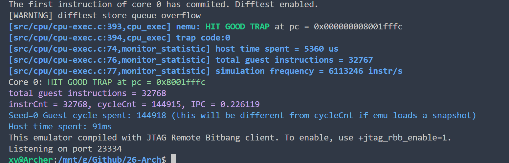

# Lab2 实现说明

## 1. 总览

Lab2 的目标是为五级流水 CPU 接入真实数据访存，并支持以下指令：

- Load：`lb, lh, lw, ld, lbu, lhu, lwu`
- Store：`sb, sh, sw, sd`
- 立即数上半部：`lui`

核心实现文件是 `vsrc/src/core.sv`，其中：

- 指令译码：约 `288-339` 行
- 数据总线请求：`229-233` 行
- Store 掩码与数据对齐：`482-491` 行
- Load 数据对齐与扩展：`494-503` 行
- MEM->WB 结果选择：`507` 行

  

## 2. 统一数据通路（所有访存指令共用）

### 2.1 译码到执行寄存器

LOAD/STORE 在 ID 阶段产生 `id_dec_is_load`/`id_dec_is_store`、`id_dec_mem_size`、`id_dec_mem_unsigned`，并在 EX->MEM 流水传递：

```systemverilog
ex_r.mem_size <= id_dec_mem_size;
ex_r.mem_unsigned <= id_dec_mem_unsigned;
```

（`core.sv:885-886`）

### 2.2 总线请求发起（MEM 阶段）

```systemverilog
assign dreq.valid  = mem_r.valid && (mem_r.is_load || mem_r.is_store) && !trap_commit;
assign dreq.addr   = mem_r.mem_addr;
assign dreq.size   = msize_t'(mem_r.mem_size);
assign dreq.strobe = mem_r.mem_wstrb;
assign dreq.data   = mem_r.mem_wdata;
```

（`core.sv:229-233`）

说明：

- Load：`strobe` 被设置为 0（见 `mem_r.mem_wstrb <= ex_r.is_store ? mem_store_strobe : 8'd0;`，`core.sv:869`）
- Store：`strobe` 为字节写掩码，`data` 为按地址偏移后的写数据。

### 2.3 Store 对齐逻辑

```systemverilog
MSIZE1: mem_store_strobe = 8'b0000_0001 << ex_mem_addr[2:0];
MSIZE2: mem_store_strobe = 8'b0000_0011 << ex_mem_addr[2:0];
MSIZE4: mem_store_strobe = 8'b0000_1111 << ex_mem_addr[2:0];
MSIZE8: mem_store_strobe = 8'b1111_1111;
assign mem_store_data_shifted = ex_r.rs2_store << ({ex_mem_addr[2:0], 3'b000});
```

（`core.sv:484-487, 491`）

### 2.4 Load 回收逻辑

```systemverilog
assign mem_aligned_data = dresp.data >> (mem_byte_shift * 6'd8);
MSIZE1: mem_load_data = mem_r.mem_unsigned ? {56'd0, mem_aligned_data[7:0]}  : {{56{mem_aligned_data[7]}},  mem_aligned_data[7:0]};
MSIZE2: mem_load_data = mem_r.mem_unsigned ? {48'd0, mem_aligned_data[15:0]} : {{48{mem_aligned_data[15]}}, mem_aligned_data[15:0]};
MSIZE4: mem_load_data = mem_r.mem_unsigned ? {32'd0, mem_aligned_data[31:0]} : {{32{mem_aligned_data[31]}}, mem_aligned_data[31:0]};
MSIZE8: mem_load_data = mem_aligned_data;
assign mem_stage_result = mem_r.is_load ? mem_load_data : mem_r.result;
```

（`core.sv:494, 499-503, 507`）

## 3. 每条指令如何实现

## 3.1 `lui`

译码位置：`core.sv:288-292`

关键行为：

- `id_opcode == 7'b0110111` 命中 LUI
- `id_dec_wen = 1'b1`
- `id_dec_op1 = 64'd0`
- `id_dec_op2 = id_imm_u`
- ALU 默认是加法，因此结果为 `0 + imm_u`

效果：把 U 型立即数（低 12 位补 0）写入 `rd`。

## 3.2 `lb`

译码位置：`core.sv:322`

关键控制：

- `id_dec_is_load = 1`
- `id_dec_mem_size = MSIZE1`
- `id_dec_mem_unsigned = 0`

数据回收：`MSIZE1` 且有符号扩展（`core.sv:499` 右支）。

效果：读取 1 字节并符号扩展到 64 位。

## 3.3 `lbu`

译码位置：`core.sv:326`

关键控制：

- `id_dec_mem_size = MSIZE1`
- `id_dec_mem_unsigned = 1`

数据回收：`MSIZE1` 且零扩展（`core.sv:499` 左支）。

效果：读取 1 字节并零扩展到 64 位。

## 3.4 `lh`

译码位置：`core.sv:323`

关键控制：

- `id_dec_mem_size = MSIZE2`
- `id_dec_mem_unsigned = 0`

数据回收：`MSIZE2` 且有符号扩展（`core.sv:500` 右支）。

效果：读取 2 字节并符号扩展到 64 位。

## 3.5 `lhu`

译码位置：`core.sv:327`

关键控制：

- `id_dec_mem_size = MSIZE2`
- `id_dec_mem_unsigned = 1`

数据回收：`MSIZE2` 且零扩展（`core.sv:500` 左支）。

效果：读取 2 字节并零扩展到 64 位。

## 3.6 `lw`

译码位置：`core.sv:324`

关键控制：

- `id_dec_mem_size = MSIZE4`
- `id_dec_mem_unsigned = 0`

数据回收：`MSIZE4` 且有符号扩展（`core.sv:501` 右支）。

效果：读取 4 字节并符号扩展到 64 位。

## 3.7 `lwu`

译码位置：`core.sv:328`

关键控制：

- `id_dec_mem_size = MSIZE4`
- `id_dec_mem_unsigned = 1`

数据回收：`MSIZE4` 且零扩展（`core.sv:501` 左支）。

效果：读取 4 字节并零扩展到 64 位。

## 3.8 `ld`

译码位置：`core.sv:325`

关键控制：

- `id_dec_mem_size = MSIZE8`
- `id_dec_mem_unsigned = 0`（对 64 位读来说无影响）

数据回收：`MSIZE8: mem_load_data = mem_aligned_data`（`core.sv:502`）。

效果：读取完整 8 字节到 64 位寄存器。

## 3.9 `sb`

译码位置：`core.sv:336`

关键控制：

- `id_dec_is_store = 1`
- `id_dec_mem_size = MSIZE1`

写掩码：`0000_0001 << addr[2:0]`（`core.sv:484`）

写数据：`rs2_store << (addr[2:0]*8)`（`core.sv:491`）

效果：仅目标 1 字节被写入。

## 3.10 `sh`

译码位置：`core.sv:337`

关键控制：

- `id_dec_mem_size = MSIZE2`

写掩码：`0000_0011 << addr[2:0]`（`core.sv:485`）

写数据：同样按地址低位移位（`core.sv:491`）。

效果：写入 2 字节。

## 3.11 `sw`

译码位置：`core.sv:338`

关键控制：

- `id_dec_mem_size = MSIZE4`

写掩码：`0000_1111 << addr[2:0]`（`core.sv:486`）

写数据：按偏移移位（`core.sv:491`）。

效果：写入 4 字节。

## 3.12 `sd`

译码位置：`core.sv:339`

关键控制：

- `id_dec_mem_size = MSIZE8`

写掩码：全 1（`1111_1111`，`core.sv:487`）。

效果：写入完整 8 字节。

## 4. 指令执行正确性的关键保障

1. 访存等待阻塞

- `stall_mem_busy` 在 `dresp.data_ok` 到达前保持 MEM，不让流水越过未完成访存（`core.sv:207, 850`）。

2. 前端并发抑制

- `stall_if_mem` 时拉低 `ireq.valid`，降低 I/D 总线竞争（`core.sv:208, 226`）。

3. Load/非Load 统一写回入口

- `mem_stage_result` 选择器统一了写回行为，避免路径分叉错误（`core.sv:507`）。

## 5. 小结

每条 Lab2 指令都不是“单点硬编码”，而是通过统一的访存框架实现：

- 译码决定语义（size/unsigned/load/store）；
- EX 决定地址与写 lane；
- MEM 发请求并处理响应；
- WB 统一提交结果。

因此该实现既满足当前指令集需求，也便于后续继续扩展更多访存类指令。
